Import models are loaded with data that's compressed and optimized, and then stored to disk by the VertiPaq storage engine. It's possible to achieve 10x compression.
Compelling reasons to achieve smaller data size despite the above efficiencies:
- Less resource (memory), work better on **shared and premium capacities**
- Faster data updates/refresh 
- Easier manage 
- Faster calculations 
[Data reduction techniques for Import modeling - Power BI | Microsoft Learn](https://learn.microsoft.com/en-us/power-bi/guidance/import-modeling-data-reduction)
### Techniques
#### 1. **Remove Unused Columns**
- Ask: Does this column appear in reports, calculations, or relationships?
- If not, **remove it** (a.k.a. _vertical filtering_).
- Tip: Easier to add columns later than risk breaking reports by removing them later.
#### 2. **Remove Unnecessary Rows**
- Load fewer rows by **filtering by time** (e.g. last 5 years only) or **by entity** (e.g. specific region).
- Known as _horizontal filtering_.
- Saves space and simplifies row-level security (RLS), but may require duplicate reports or separate permissions.
#### 3. **Pre-Aggregate or Summarize**
- Change the data "grain"—e.g. store monthly sales totals instead of every transaction
- Can reduce size by **up to 99%**, but at the cost of drill-down detail.
- Can combine with DirectQuery for detailed views (explained below).
#### 4. **Optimize Column Data Types**
- Prefer **numeric values** (compressed with value encoding) over **text** (stored using less efficient hash encoding).
- E.g. Remove prefixes from IDs (SO12345 → 12345) and convert to whole numbers.
#### 5. **Use Power Query for Custom Columns**
- Power Query (M language) computed columns are better for performance than DAX-calculated columns.
- If the source is a SQL database, do calculations in the SQL query or materialize them in the database if possible.
#### 6. **Disable Power Query Query Loads**
- If a query is just supporting another one (like a helper step), **don’t load it into the model**.
#### 7. **Disable Auto Date/Time**
- This feature creates hidden tables for every date column and increases model size.
- Turn it off if you use your own proper date table.
#### 8. **Use DirectQuery for Large Tables**
- Instead of importing, DirectQuery pulls data live when needed.
- Great for rarely queried, large fact tables.
- Ideal combo: Use summarized import data for general visuals + DirectQuery for drillthrough pages.

### 2. Checklist
# ✅ Data Reduction Techniques Checklist

## 🗃️ Column Management
- [ ] Remove unused columns (used in neither visuals nor calculations)
- [ ] Replace text columns with numeric values when possible
- [ ] Set "Do Not Summarize" for identifier columns (e.g. Order IDs)
## 📉 Row Management
- [ ] Filter fact tables by recent time periods (e.g. last 5 years)
- [ ] Filter dimension tables (e.g. only load relevant regions/customers)
- [ ] Use Power Query parameters for flexible filtering
## 🔄 Pre-Aggregate / Summarize
- [ ] Raise data granularity (e.g. daily to monthly summaries)
- [ ] Replace detailed tables with summarized facts (if granularity isn’t critical)
- [ ] Consider combining with DirectQuery for drillthrough needs
## 🔧 Data Type Optimization
- [ ] Convert hash-encoded text columns to whole numbers
- [ ] Use integers instead of decimals if possible
- [ ] Avoid high-cardinality columns when not needed
## 🧮 Computed Columns
- [ ] Use Power Query (M) for custom columns instead of DAX
- [ ] Push calculations to SQL source if applicable
- [ ] Avoid model-calculated columns unless necessary
## 🛠️ Model Hygiene
- [ ] Disable query load for helper Power Query steps
- [ ] Turn off Auto Date/Time (use custom Date table instead)
## 💡 Hybrid Storage
- [ ] Set large fact tables to DirectQuery mode when applicable
- [ ] Use composite models: Import (summary) + DirectQuery (drillthrough)

### 3. Visual guide

```mermaid
graph TD
    A[Start Model Optimization] --> B[Remove Unused Columns]
    B --> C[Remove Unneeded Rows]
    C --> D[Pre-Aggregate Data]
    D --> E[Optimize Data Types]
    E --> F[Use Power Query for Calculated Columns]
    F --> G[Disable Auto Date/Time + Query Loads]
    G --> H[Switch Large Tables to DirectQuery]
    H --> I[Achieve Smaller, Faster Model 🎯]
```

