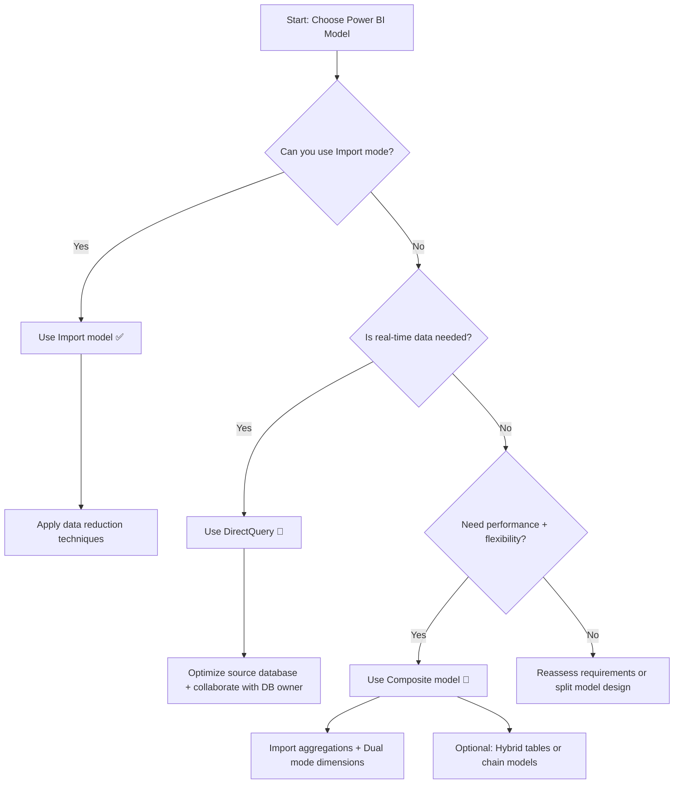

[Choose a Power BI model framework - Training | Microsoft Learn](https://learn.microsoft.com/en-us/training/modules/choose-power-bi-model-framework/)
Hopefully after completing this section, you should be able to confidently answer questions about selecting tables and semantic model storage modes based on requirements for optimization, model refresh strategies, and loading times. For example:
**Question:**
You have a Power BI model with the following fact tables and storage modes.
- `FactStoreSales` (Import mode)
- `FactOnlineSales` (DirectQuery mode)
You have a dimension table named `DimCalendar` that has a relationship to both fact tables. You need to assign a storage mode for `DimCalendar`. The solution must minimize the time to execute queries that combine data from the dimension table and the fact tables.
Which storage mode should you use?
**Answer: Dual** 
Using Dual mode means that either an import query can be run when accessing data from `FactStoreSales`, or a DirectQuery query can be run when accessing data from `FactOnlineSales`. Using Import mode means the queries are only optimized for `FactStoreSales` (Import). Using DirectQuery mode means the queries are only optimized for `FactOnlineSales` (DirectQuery). A storage mode of Import, DirectQuery, or Dual must be assigned.

[Select a storage mode - Training | Microsoft Learn](https://learn.microsoft.com/training/modules/get-data/6-storage-mode)
[Use storage mode in Power BI Desktop - Power BI | Microsoft Learn](https://learn.microsoft.com/power-bi/transform-model/desktop-storage-mode)

---
## 1. Power BI model fundamentals
- Data model
- Power BI dataset
- Analytic query
- Tabular model
- Star schema design
- Table storage mode
- Model framework
#### Data model 
A Power BI data model (sematic model) is a query-able data resource that’s optimized for analytics.
- Analytic languages: DAX (Power BI, paginated report) and MDX - Multidimension Expression (paginated report)
#### Power BI dataset 
 A dataset is a Power BI artifact that’s a source of data for visualizations in Power BI reports and dashboards:
- Some datasets represent connections to external-hosted models in AAS or SSAS.
- push datasets, streaming datasets, or hybrid datasets
#### Analytic query 
An analytic query produces a query result from a model that’s easy for a person to understand, especially when visualized.
An analytic query has three phases that are executed in this order:
1. Filter
2. Group
3. Summarize

> [! Tip] 🧠 It's a question you ask your data to get a meaningful answer you can understand and use.
###### 1. Filter: 
 In a Power BI report, you can set filters at report, page, or visual level. Report layouts often include slicer visuals to filter visuals on the report page. 
 - row-level security (RLS), it applies filters to model tables to restrict access to specific data
###### 2. Grouping: 
Splitting the data into categories so you can see results for each one.
###### 3. Summarize:
Produces **a single value result** using an aggregate function (sum, count, minimum, maximum, and others) 
##### Tabular model 
A Power BI model is a tabular model. A tabular model comprises one or more tables of columns. It can also include relationships, hierarchies, and calculations.
A **tabular model** is a **type** of **semantic model** (but not all sematic models are tabular models). 
##### Star Schema design 
Star Schema : Fact and Dimension tables 
- Dimension tables describe business entities; the things you model. Entities can include products, people, places, and concepts including time itself.
- Fact tables store observations or events, example, sales orders, stock balances, exchange rates, or temperature readings:
	-  dimension key columns that relate to dimension tables
	- numeric measure columns.
==*In an analytic query, dimensions table columns filter or group. Fact table columns are summarized.*==
##### Table storage mode
[[Storage modes in Power BI]]
The storage mode property can be either **Import**, **DirectQuery**, or **Dual**, and it determines whether table data is stored in the model.
- **Import** – Queries retrieve data that’s stored, or cached, in the model.
- **DirectQuery** – Queries pass through to the data source.
- **Dual** – Queries retrieve stored data or pass through to the data source. Power BI determines the most efficient plan, striving to use cached data whenever possible.
##### Model Framework 
- An import model comprises tables that have their storage mode property set to **Import**.
- A DirectQuery model comprises tables that have their storage mode property set to **DirectQuery**, and they belong to the **same source group**.
- A composite model comprises **more than one source group.**

| Model Framework | How It Works                                                 | When to Use It                                             |
| --------------- | ------------------------------------------------------------ | ---------------------------------------------------------- |
| **Import**      | Data is copied and stored inside Power BI. Fast performance. | Best for small to medium datasets or when speed matters.   |
| **DirectQuery** | Data stays in the original source. Power BI queries it live. | Good for large datasets or when data changes often.        |
| **Composite**   | Mix of Import and DirectQuery.                               | Great when you need flexibility—some data fast, some live. |
## 2. Determine when to develop an **Import model**
### 2.1. Import Model benefits
Import models are the most frequently developed model framework:
- Support all Power BI data source types (databases, files, feeds, web pages, dataflows,etc)
- Can integrate source data. For example, one table sources its data from a relational database while a related table sources its data from a web page.
- Support all DAX and Power Query (M) functionality.
- Support calculated tables.
- Deliver the best query performance. That’s because the data cached in the model is optimized for analytic queries (filter, group, and summarize) and the model is stored entirely in memory.
### 2.2. Limitations 
Limitations are related to **model size** and **data refresh**.
#### 2.2.1. Model size
When publish the model to a shared capacity, there’s ==a 1-GB limit per dataset (compressed size of Power BI model)==.
When publish the model to dedicated capacity (Premium), beyond 10-GB (must enable the [Large dataset storage format setting](https://learn.microsoft.com/en-us/power-bi/enterprise/service-premium-large-models) for the capacity).
The amount of data should be reduced to optimize speed. Data reduction techniques that you can apply, including:
[[Checklist - Data Reduction techniques for Import mode]]
- Remove unnecessary columns
- Remove unnecessary rows
- Group by and summarize to raise the grain of fact tables
- Optimize column data types with a preference for numeric data
- Preference for custom columns in Power Query instead of calculated columns in the model
- Disable Power Query query load
- Disable auto date/time
- Use DirectQuery table storage, as described in later units of this module.
#### 2.2.2. Data refresh - Incremental refresh 
Scheduled refreshing limits:  **8 times/day in a shared capacity** and up to **48 times/day in a dedicated capacity**
Alternative model when the data has high velocity and scheduled refresh limits: DirectQuery storage tables, creating a hybrid table or a real-time dataset instead. 
###### Incremental refresh 
- A method to **refresh only new or changed data**, not the whole table.
- Improves performance and reduces strain on source systems.
###### How it works?
- Splits the table into **time-based partitions** (e.g. by day/month)
- Automatically detects and refreshes **only the changed partitions**
- Older, stable data stays untouched
###### Advanced strategy
  - Customize partitioning using **automation scripts**
  - Manage partition logic via **XMLA endpoint** (Power BI Premium only)
  - For pros managing enterprise-scale data models
## 3. Determine when to develop an **DirectQuery model**
A DirectQuery model comprises tables that have their storage mode property set to **DirectQuery**, and they belong to the same source group.
### 3.1. Models benefits
#### - Model large or fast-changing data sources
They don't require refresh.
Well suited to large data stores (data warehouse).
#### - Enforce source RLS (row-levels-security)
The source data base can enforce its rules but only work for some relational databases. 
#### - Data sovereignty restrictions
Support on-premises data source.
**On-premises reporting** means Power BI reports and dashboards **run entirely within a company’s own servers or local network**—not in the cloud, using **Power BI Report Server**, appropriate for organizations who prioritize security and privacy. 
This approach:
- Keeps sensitive data **on-site**
- Still allows reporting and analytics
- Avoids breaking company or legal rules
#### - Specialize dataset 
##### What’s a Specialized Dataset?
- A dataset built on top of another existing Power BI dataset or Azure Analysis Services model.
- Uses **DirectQuery** to connect to the remote model, treating it as a data source.

**Connect to an existing Power BI dataset** (or Azure Analysis Services model) and treat it like a **data source**. This creates a **chained model** setup where:
- The original dataset = **remote model**
- The new dataset = **local model**
Use this approach when you want to **customize a centralized dataset** without rebuilding everything from scratch.
##### Benefits 
- Allows you to **reuse and extend existing datasets** across different teams or reports
- Helps maintain **data consistency** while allowing **customization** locally
- Promotes **modular, reusable reporting**
- Enables **personalization** without modifying the original dataset
- Useful for **enterprise-scale deployments** with shared data models
### 3.2. Limitations
- Not all data sources are supported. Typically, only major relational database systems are supported.
- All Power Query (M) transformations are not possible, because these queries must translate to native queries.
- Analytic query performance can be slow, especially if source systems aren’t optimized.
- Analytic queries can impact on source system performance, including OLTP.
### 3.3. Boost DirectQuery model performance
- Data source optimization: create indexes column, use materialized view (pre-aggregate) 
- User-defined tables (hidden model tables, parts of sematic model and not visible to user or RLS)
## 4. Determine when to develop an **Composite model**
A composite model comprises more than one source group. Typically, there’s always the import source group and a DirectQuery source group.
### 4. Model benefits 

#### 1. Design Flexibility
Combine **imported and live (DirectQuery)** tables in one model: 
- Choose the best storage mode for each data source or table: utilize **Import mode** for fast, cached data and **DirectQuery** for live, real-time data
- Tailor storage mode to performance and freshness needs
#### 2. Performance Optimization
- Use **imported tables** to satisfy high-volume or common queries
- Cached data delivers faster performance compared to querying live
- DirectQuery is used only where real-time accuracy is essential
#### 3. Extend Remote Datasets
- When connecting to a remote dataset (e.g. Power BI dataset or Azure AS model), you can:
  - Rename columns or tables
  - Add new **calculated tables** or **measures**
  - Include your own import or DirectQuery tables
- Creates a **specialized local model** layered on a **shared remote model**
#### 📌 Use Case Example
An enterprise BI team shares a certified dataset (remote). A local analyst team extends it by adding region-specific metrics and importing supplemental data sources.
### 4.2. Limitations 
#### 1. Import Storage Mode Still Requires Refresh
- Imported or dual-mode tables must be refreshed periodically
- Risk: Data drift between **imported vs DirectQuery** tables
#### 2. Performance Impact of Mixed Queries
- Queries involving both Import and DirectQuery data = slower performance
- Power BI consolidates source group results = more resource intensive
- 📌 Optimization: Use **Import Aggregation Tables** + **Dual Mode Dimension Tables**
#### 3. Chaining Risk in Remote Models
- Local model connects to a remote (chained) Power BI dataset
- Changes upstream can break your dependent model
- ✅ Do **dataset impact analysis** before making changes
#### 4. Limited Relationships
- Happen when:
  - Relationship is **many-to-many**
  - Or spans **different source groups**
- Behavior: May affect query logic and return unexpected results
#### 📝 Summary Tip
While composite models offer flexibility, careful planning and refresh strategies are essential to maintain accuracy, performance, and reliability.

### 4.3.  Boosting DirectQuery Performance with Import Tables

#### Purposes
- DirectQuery keeps data live, but may suffer from slow query performance
- Power BI can use **import techniques** to reduce delays while keeping data fres
#### 🔸 1. Import Aggregation Tables
- Used for answering **high-level (summarized)** queries
- Power BI can skip full table scans and use the cached version
- Option to enable **automatic aggregations** (Premium only)
- Boosts performance especially with **large fact tables**
- ✅ Tip: Set dimension tables (e.g. Date, Product) to **Dual Mode**
#### 🔸 2. Dual Storage Mode
- A table can act as Import or DirectQuery depending on the query
- Power BI prioritizes cached data when possible
- **Slicers and filter cards** load much faster from cache
- Great companion to import aggregation tables
#### 🧩 Combined Impact
- Reduced response time for users
- Lower resource usage on the underlying data source
- Preserves flexibility of real-time access where needed
##### Related Topics
- Automatic aggregations (Premium)
- Composite models
- Dual vs Import vs DirectQuery storage modes
##  5. Choose a model framework

### 🔹 General Recommendation
- [ ] Default to **Import mode** whenever possible
  - [ ] Apply data reduction techniques
  - [ ] Ensure optimal performance and flexibility
### 🔸 Use **DirectQuery** when:
- [ ] Data volume is **too large** to import
- [ ] The report must deliver **near real-time data**
- [ ] You have optimized:
  - [ ] Database indexes
  - [ ] Materialized views
  - [ ] Hardware resources (in cooperation with DB owner)
### 🔸 Use a **Composite model** when:
- [ ] You want to **boost DirectQuery performance** with aggregation tables
  - [ ] Import or DirectQuery aggregations
  - [ ] Related dimension tables set to **Dual mode**
- [ ] You want **near real-time queries** in an import model
  - [ ] Use **hybrid tables** (import + DirectQuery partitions)
- [ ] You want to **extend a Power BI or AAS dataset**
  - [ ] Add custom measures or columns
  - [ ] Add new import or DirectQuery tables

### ⚠️ Caution
- [ ] Converting **DirectQuery to Import** is possible
- [ ] 🚫 Converting **Import to DirectQuery** is **not** supported
- [ ] Plan your model layout and refresh strategy carefully

